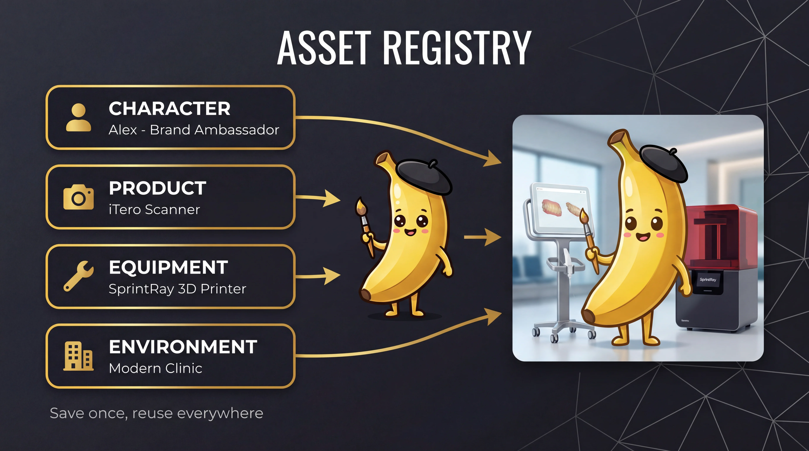
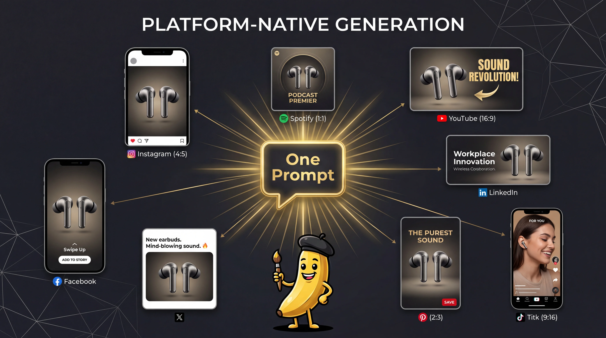
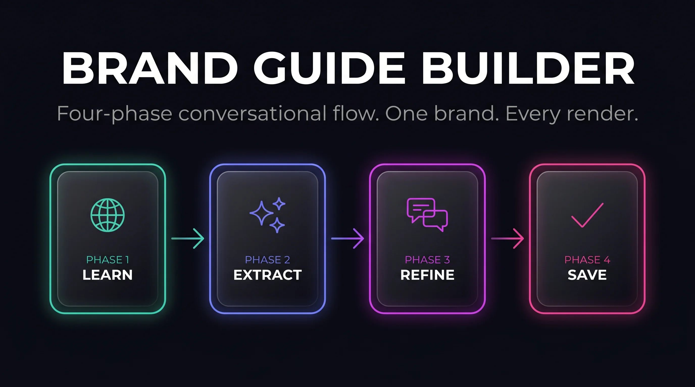

<!-- Updated: 2026-04-06 -->
<!-- Forked from: https://github.com/AgriciDaniel/banana-claude -->


# Banana Claude

AI image generation skill for Claude Code where **Claude acts as Creative Director** using Google's Gemini Nano Banana models.

Unlike simple API wrappers, Claude interprets your intent, selects domain expertise, constructs optimized prompts using Google's official 5-component formula, and orchestrates Gemini for the best possible results.

[](https://claude.ai/claude-code)
[](CHANGELOG.md)
[](LICENSE)
[](https://github.com/AgriciDaniel/banana-claude)

> **Blog:** [See banana-claude in action](https://agricidaniel.com/blog/banana-claude-ai-image-generation)

<details>
<summary>Table of Contents</summary>

- [What's New in This Fork](#whats-new-in-this-fork)
- [Installation](#installation)
- [Quick Start](#quick-start)
- [Commands](#commands)
- [How It Works](#how-it-works)
- [What Makes This Different](#what-makes-this-different)
- [The 5-Component Prompt Formula](#the-5-component-prompt-formula)
- [Domain Modes](#domain-modes)
- [Presentation Mode](#presentation-mode)
- [Brand Style Guides](#brand-style-guides)
- [Replicate Backend](#replicate-backend)
- [Models](#models)
- [Architecture](#architecture)
- [Requirements](#requirements)
- [Upstream Tracking](#upstream-tracking)
- [Changelog](CHANGELOG.md)
- [License](#license)

</details>

## What's New in This Fork

This fork extends [AgriciDaniel/banana-claude](https://github.com/AgriciDaniel/banana-claude) with features driven by production use and research analysis of Google's prompting guidance:

### Visual Brand Book Generator (v2.0.0)
Generate complete visual brand books from any preset in three formats: Markdown + images, PowerPoint (.pptx), and self-contained HTML (print to PDF). Three tiers — quick (5 images), standard (16), comprehensive (25+). Automatic Hex → RGB → CMYK → Pantone color conversion with 156 Pantone Coated colors.

### Reverse Prompt Engineering (v1.9.0)
Upload any image and Claude decomposes it into a structured 5-Component Formula prompt — identifying domain mode, camera specs, lighting, composition, and style. Compares Claude vs Gemini perspectives and provides a blended best-of-both prompt.

### Asset Registry (v1.8.0)
Persistent named references for characters, products, equipment, and environments. Save once with reference images, reuse across sessions — Claude automatically loads reference images and consistency notes into every generation.

### Social Media Generation (v1.7.0)
Platform-native image generation for 46 social media platforms. Generates at the correct native ratio at 4K resolution, then auto-crops to exact platform pixel specs. One prompt → multiple platform-specific images. Groups platforms by ratio to avoid duplicate API calls.

### Brand Guide Builder (v1.7.0)
Conversational brand guide creation: learn from websites/PDFs/images → auto-extract colors, typography, mood → refine interactively → preview with sample image → save. Ships with 12 example brand presets covering tech, luxury, organic, fitness, healthcare, fashion, and more.

### Slide Deck Pipeline (v1.6.0)
Three-step batch pipeline: content → design brief → prompts → batch-generate all slide images. Replaces a manual 3-step, 2-session workflow.

### Presentation Mode (v1.5.0)
Two generation options for slide visuals:
- **Complete Slide** -- Nano Banana 2 renders headline and body text directly in the image, producing finished slides
- **Background Only** -- Clean backgrounds with intentional negative space, designed for layering text and logos in Keynote/PowerPoint/Google Slides

Logos are never mentioned in prompts (the model generates unwanted artifacts). Instead, logo areas are described as "clean negative space" and logos are composited in presentation software.

### Brand Style Guides (v1.5.0)
Enhanced preset system with 8 new optional fields for project-wide visual consistency:
- `background_styles` -- Named background variants (dark-premium, gradient, split-layout)
- `visual_motifs` -- Pattern overlays with opacity (e.g., "geometric network at 30%")
- `prompt_suffix` -- Appended verbatim to every prompt for brand consistency
- `prompt_keywords` -- Categorized keywords woven naturally into prompts
- `do_list` / `dont_list` -- Brand guardrails checked before generation
- `logo_placement` -- Records where logos go in post-production (not in prompts)
- `technical_specs` -- Default color space, DPI, and other technical standards

Fully backward-compatible -- existing simple presets continue to work unchanged.

### Replicate Backend (v1.4.2)
`google/nano-banana-2` on Replicate as an alternative API backend. Fallback chain: MCP (primary) -> Direct Gemini API -> Replicate. Includes `replicate_generate.py` and `replicate_edit.py` (stdlib-only, zero pip deps).

### Research-Driven Improvements (v1.4.2)
Based on analysis of Google's official prompting guides and two research documents:
- **5-Input Creative Brief** -- Purpose, Audience, Subject, Brand, References
- **"Start with Intent, Refine with Specs"** -- Two-phase prompting with PEEL strategy (Position, Expression, Environment, Lens)
- **Edit-First Principle** -- 90% of refinements should edit, not regenerate
- **Progressive Enhancement** -- 4-phase workflow for multi-turn chat sessions
- **Expanded character consistency** -- Identity-locked patterns, group photos (up to 5 people), sequential storytelling
- **Multilingual support** -- Translation within images, cultural adaptation
- **Official spec corrections** -- Output tokens (2,520 not 1,290), HEIC/HEIF input, resolution pixel tables

## Installation

### Prerequisites

- [Claude Code](https://claude.ai/claude-code) installed and working
- [Git](https://git-scm.com/) installed
- [Node.js 18+](https://nodejs.org/) installed (for the MCP server)

### Step 1: Clone the Repository

```bash
git clone https://github.com/juliandickie/banana-claude.git ~/banana-claude
```

### Step 2: Get Your Google AI API Key (Free)

1. Go to [Google AI Studio](https://aistudio.google.com/apikey)
2. Sign in with your Google account
3. Click **"Create API Key"**
4. Select any Google Cloud project (or create one -- it's free)
5. Copy the key (starts with `AIza...`)

> **Note:** The free tier gives you ~5-15 images per minute and ~20-500 per day. No credit card required. For higher limits, enable billing in Google Cloud Console.

### Step 3: Start Claude Code with the Plugin

```bash
claude --plugin-dir ~/banana-claude
```

### Step 4: Configure Your API Key

In Claude Code, run:

```
/banana setup
```

Claude will walk you through the process conversationally — explaining what the key is, where to get it, and asking you to paste it in the chat. Your key is saved to:
- `~/.claude/settings.json` (for the MCP server)
- `~/.banana/config.json` (for fallback scripts)

Keys never leave your machine and are not sent to GitHub.

### Step 5: Test It

```
/banana generate "a golden banana wearing a beret"
```

If you see an image path and the file exists, you're all set!

### Updating

```bash
cd ~/banana-claude && git pull
```

Then in Claude Code, type `/reload-plugins` to pick up changes.

<details>
<summary>Optional: Replicate as Fallback Backend</summary>

Replicate provides an alternative API backend using `google/nano-banana-2`. It's useful when the MCP server isn't available, or if you prefer simpler auth. It costs ~$0.05/image (no free tier).

**Getting your Replicate API token:**

1. Go to [replicate.com/account/api-tokens](https://replicate.com/account/api-tokens)
2. Sign in with GitHub, Google, or email
3. Click **"Create token"**
4. Give it a name (e.g., "banana-claude")
5. Copy the token (starts with `r8_...`)

**Configure it in Claude Code:**

```
/banana setup replicate
```

Claude will walk you through the process and ask you to paste the token. Your token is saved to `~/.banana/config.json` and never leaves your machine.

The fallback chain is automatic: MCP → Direct Gemini API → Replicate.

</details>

<details>
<summary>Standalone Install (without plugin system)</summary>

If you prefer to copy the skill files rather than use the plugin system:

```bash
git clone https://github.com/juliandickie/banana-claude.git ~/banana-claude
bash ~/banana-claude/install.sh
```

To update: `cd ~/banana-claude && git pull && bash install.sh`

</details>

## Quick Start

```bash
# Generate an image (Claude acts as Creative Director)
/banana generate "a hero image for a coffee shop website"

# Edit an existing image
/banana edit ~/photo.png "remove the background and add warm lighting"

# Multi-turn creative session with character/style consistency
/banana chat

# Generate for multiple social platforms at once (46 platforms)
/banana social "product launch hero" --platforms ig-feed,yt-thumb,li-feed,tt-feed

# Build a brand guide from your website or documents
/banana brand

# Generate a slide deck from transcripts or content
/banana slides plan --content ~/transcripts/ --preset my-brand

# Save a product/character for consistent reuse across sessions
/banana asset create "my-headphones" --type product \
  --reference ~/photos/headphones.jpg \
  --description "wireless earbuds in white charging case"

# Use a brand preset for visual consistency
/banana preset list                    # see available presets
/banana preset create my-brand --colors "#000,#FFC000" --style "premium dark"

# Generate 3 variations (Literal, Creative, Premium)
/banana batch "landing page hero for fintech app" 3

# Reverse engineer a prompt from an image
/banana reverse ~/photos/inspiration.jpg

# Generate a visual brand book (markdown + pptx + html)
/banana book --preset my-brand --tier standard --output ~/brand-book/

# Browse prompt inspiration
/banana inspire

# Check costs and usage
/banana cost summary

# Setup, status, and updates
/banana setup                          # configure API key (guided)
/banana status                         # check version + keys
/banana update                         # pull latest from GitHub
```

Claude will ask about your brand, select the right domain mode (Cinema, Product, Portrait, Editorial, UI, Logo, Landscape, Infographic, Abstract, Presentation), construct a detailed prompt with lighting and composition, set the right aspect ratio, and generate.


## Commands

| Command | Description |
|---------|-------------|
| `/banana` | Interactive -- Claude detects intent and guides you |
| `/banana generate <idea>` | Full Creative Director pipeline |
| `/banana edit <path> <instructions>` | Intelligent image editing |
| `/banana chat` | Multi-turn visual session (character/style consistent) |
| `/banana slides [plan\|prompts\|generate]` | Slide deck pipeline: content → design brief → prompts → batch images |
| `/banana inspire [category]` | Browse prompt database for ideas |
| `/banana batch <idea> [N]` | Generate N variations (default: 3) |
| `/banana social <idea> --platforms <list>` | Platform-native image generation (47 platforms, 4K, auto-crop) |
| `/banana brand` | Conversational brand guide builder (learn → refine → preview → save) |
| `/banana asset [list\|show\|create\|delete]` | Manage persistent character/product/object references |
| `/banana reverse <image-path>` | Analyze image → extract 5-Component Formula prompt |
| `/banana book --preset <name> [--tier quick\|standard\|comprehensive]` | Generate visual brand book (markdown + pptx + html) |
| `/banana setup` | Guided Google AI API key setup |
| `/banana setup replicate` | Guided Replicate token setup (optional fallback) |
| `/banana status` | Check version, installation, and API key status |
| `/banana update` | Pull latest version from GitHub |
| `/banana preset [list\|create\|show\|delete]` | Manage brand/style presets |
| `/banana cost [summary\|today\|estimate]` | View cost tracking and estimates |

## How It Works


## What Makes This Different


- **5-Input Creative Brief** -- Gathers Purpose, Audience, Subject, Brand, and References before generating
- **Domain Expertise** -- Selects the right creative lens (Cinema, Product, Portrait, Editorial, UI, Logo, Landscape, Infographic, Abstract, Presentation)
- **5-Component Prompt Formula** -- Constructs prompts with Subject + Action + Location/Context + Composition + Style (includes lighting)
- **Start with Intent, Refine with Specs** -- Two-phase prompting using the PEEL strategy for iterative refinement
- **Edit-First Workflow** -- 90% of refinements edit the image rather than regenerating from scratch
- **Brand Style Guides** -- Rich preset system with background styles, motifs, keywords, do's/don'ts, and prompt suffixes
- **Presentation Mode** -- Two options: complete slides with rendered text, or clean backgrounds for layering
- **Prompt Adaptation** -- Translates patterns from a 2,500+ curated prompt database to Gemini's natural language format
- **Post-Processing** -- Crops, removes backgrounds, converts formats, resizes for platforms
- **Batch Variations** -- Generates N variations with Literal/Creative/Premium prompt styles
- **Session Consistency** -- Maintains character/style across multi-turn conversations with progressive enhancement
- **Triple Fallback** -- MCP -> Direct Gemini API -> Replicate for maximum availability
- **4K Resolution Output** -- Up to 4096×4096 with `imageSize` control
- **14 Aspect Ratios** -- Including ultra-wide 21:9 and extreme 8:1 for banners

## The 5-Component Prompt Formula


Instead of sending "a cat in space" to Gemini, Claude constructs:

> A medium shot of a tabby cat floating weightlessly inside the cupola module
> of the International Space Station, paws outstretched toward a floating
> droplet of water, Earth visible through the circular windows behind. Soft
> directional light from the windows illuminates the cat's fur with a
> blue-white rim light, while the interior has warm amber instrument panel
> glow. Captured with a Canon EOS R5, 35mm f/2.0 lens, slight barrel
> distortion emphasizing the curved module interior. In the style of a
> National Geographic cover story on the ISS, with the sharp documentary
> clarity of NASA mission photography.

**Components used:** Subject (tabby cat, physical detail) → Action (floating, paw gesture) → Location/Context (ISS cupola, Earth visible) → Composition (medium shot, curved framing) → Style (Canon R5, National Geographic documentary, directional window light + amber instruments)

## Domain Modes


| Mode | Best For | Example |
|------|----------|---------|
| **Cinema** | Dramatic, storytelling | "A noir detective scene in a rain-soaked alley" |
| **Product** | E-commerce, packshots | "Photograph my handmade candle for Etsy" |
| **Portrait** | People, characters | "A cyberpunk character portrait for my game" |
| **Editorial** | Fashion, lifestyle | "Vogue-style fashion shot for my brand" |
| **UI/Web** | Icons, illustrations | "A set of onboarding illustrations" |
| **Logo** | Branding, identity | "A minimalist logo for a tech startup" |
| **Landscape** | Backgrounds, wallpapers | "A misty mountain sunrise for my desktop" |
| **Infographic** | Data, diagrams | "Visualize our Q1 sales growth" |
| **Abstract** | Generative art, textures | "Voronoi tessellation in neon gradients" |
| **Presentation (Complete)** | Finished slides with text | "Title slide with 'DIGITAL INNOVATION' headline" |
| **Presentation (Background)** | Slide backgrounds for layering | "Dark premium background for keynote deck" |

## Presentation Mode


Presentation mode has two generation options designed for real-world slide workflows:

**Complete Slide** -- The model renders headline and body text directly in the image. Nano Banana 2's text rendering (94% accuracy under 25 characters) produces finished slides ready to use as-is. Best for title slides, quote slides, and simple content layouts.

**Background Only** -- Produces clean backgrounds with intentional negative space where text and logos will be added in Keynote, PowerPoint, or Google Slides. The prompt explicitly states "NO text, NO logos, NO labels" to prevent the model from generating unwanted artifacts.

> **Why no logos in prompts?** Gemini interprets every word literally. "Reserve space for logo" becomes "generate a logo here." The correct approach is describing the area as "clean negative space" or "simple uncluttered background," then compositing the logo as a separate layer in your presentation software where you have pixel-perfect control.

## Asset Registry



Save named characters, products, equipment, and environments with reference images for consistent reuse across sessions. When you mention a saved asset, Claude automatically loads its reference images and consistency notes.

```bash
# Save a product with reference images
/banana asset create "itero-scanner" --type product \
  --reference ~/photos/itero-front.jpg \
  --reference ~/photos/itero-angle.jpg \
  --description "Handheld intraoral scanner, white and gray body, LED ring" \
  --consistency-notes "Always show LED ring illuminated"

# Now just mention it naturally
/banana generate "the iTero Scanner being used in a modern dental clinic"
# Claude loads reference images automatically for visual consistency

# Add more reference images later
/banana asset add-image "itero-scanner" --reference ~/photos/itero-closeup.jpg

# See all saved assets
/banana asset list
```

Assets work alongside brand presets — the preset defines the visual style, the asset defines what the object looks like. Both are applied automatically when detected.

## Social Media Generation



Generate platform-native images for 46 social media platforms. One prompt, multiple platform-specific outputs — each generated at the correct native ratio at 4K, then auto-cropped to exact pixel specs.

```bash
/banana social "product launch hero for wireless earbuds" --platforms ig-feed,yt-thumb,li-feed,tt-feed
```

Platforms sharing the same ratio are grouped automatically — if Instagram feed and Facebook portrait both use 4:5, only one API call is made and cropped to both specs. Saves cost and time.

Supports: Instagram, Facebook, YouTube, LinkedIn, Twitter/X, TikTok, Pinterest, Threads, Snapchat, Google Ads, and Spotify — including organic posts, stories, ads, banners, thumbnails, and covers.

## Brand Style Guides



Enhanced presets for project-wide visual consistency. Create a brand style guide once, and every generated image inherits the brand's visual language:

```bash
# Create a brand style guide
/banana preset create premium-brand \
  --colors "#000000,#FFC000,#FFFFFF" \
  --style "premium dark photography, dramatic lighting, gold accents" \
  --mood "confident, innovative, premium" \
  --visual-motifs "geometric network pattern in silver at 30% opacity" \
  --prompt-suffix "Premium dark aesthetic with gold accents, dramatic lighting." \
  --do-list "Use negative space,High contrast,Keep patterns subtle" \
  --dont-list "No busy backgrounds,No more than 2 accent colors"

# Use it
/banana generate "title slide for digital innovation keynote"
# Claude automatically loads the brand guide and applies it
```

Brand Style Guide fields are all optional -- simple presets (just colors + style) continue to work exactly as before.

## Replicate Backend

An alternative API backend using `google/nano-banana-2` on Replicate. Useful when:
- MCP server is unavailable or not configured
- You prefer simpler auth (Replicate token vs. Google Cloud setup)
- You need webhook/async processing

```bash
# Configure Replicate
/banana setup replicate

# The fallback chain handles the rest automatically:
# 1. MCP (primary) -> 2. Direct Gemini API -> 3. Replicate
```

## Models

| Model | ID | Notes |
|-------|----|-------|
| Flash 3.1 (default) | `gemini-3.1-flash-image-preview` | Fastest, newest, 14 aspect ratios, up to 4K |
| Flash 2.5 | `gemini-2.5-flash-image` | Stable fallback |

## Architecture

```
banana-claude/                         # Claude Code Plugin
├── .claude-plugin/
│   ├── plugin.json                    # Plugin manifest
│   └── marketplace.json               # Marketplace catalog
├── skills/banana/                     # Main skill
│   ├── SKILL.md                       # Creative Director orchestrator (v2.0)
│   ├── references/
│   │   ├── prompt-engineering.md      # 5-component formula, 11 domain modes, PEEL strategy
│   │   ├── gemini-models.md           # Model specs, resolution tables, input limits
│   │   ├── mcp-tools.md              # MCP tool parameters and responses
│   │   ├── replicate.md              # Replicate backend API reference
│   │   ├── social-platforms.md        # 46 social media platform specs and ratios
│   │   ├── brand-builder.md           # Conversational brand guide creation flow
│   │   ├── asset-registry.md          # Persistent asset registry for characters/products
│   │   ├── reverse-prompt.md          # Image → 5-Component Formula prompt extraction
│   │   ├── brand-book.md             # Brand book generator (tiers, formats, colors)
│   │   ├── post-processing.md        # ImageMagick/FFmpeg pipelines, green screen
│   │   ├── cost-tracking.md          # Pricing table, usage guide
│   │   ├── presets.md                # Brand Style Guide schema (17 fields)
│   │   └── setup.md                  # Guided API key configuration flow
│   ├── presets/                       # 12 example brand guide JSON files
│   │   ├── tech-saas.json
│   │   ├── luxury-dark.json
│   │   ├── ... (10 more)
│   │   └── education-friendly.json
│   └── scripts/
│       ├── setup_mcp.py              # Configure MCP + Replicate
│       ├── validate_setup.py         # Verify installation
│       ├── generate.py               # Direct Gemini API fallback -- generation
│       ├── edit.py                   # Direct Gemini API fallback -- editing
│       ├── replicate_generate.py     # Replicate API fallback -- generation
│       ├── replicate_edit.py         # Replicate API fallback -- editing
│       ├── brandbook.py              # Visual brand book generator (3 output formats)
│       ├── pantone_lookup.py         # Color conversion (Hex/RGB/CMYK/Pantone)
│       ├── assets.py                 # Asset registry CRUD (characters, products, objects)
│       ├── social.py                 # Social media platform-native generation
│       ├── slides.py                 # Slide deck batch generation pipeline
│       ├── cost_tracker.py           # Cost logging and summaries
│       ├── presets.py                # Brand Style Guide management
│       └── batch.py                  # CSV batch workflow parser
└── agents/
    └── brief-constructor.md           # Subagent for prompt construction
```

## Requirements

- [Claude Code](https://github.com/anthropics/claude-code)
- Node.js 18+ (for npx)
- Google AI API key (free tier: ~5-15 RPM / ~20-500 RPD, cut ~92% Dec 2025)
- ImageMagick (optional, for post-processing)

## Uninstall

**Plugin:** Remove the plugin directory or stop using `--plugin-dir`.

**Standalone:**

```bash
bash banana-claude/install.sh --uninstall
```

## Upstream Tracking

This fork extends [AgriciDaniel/banana-claude](https://github.com/AgriciDaniel/banana-claude). To check for upstream changes:

```bash
git fetch upstream
git diff upstream/main   # see what changed
git merge upstream/main  # integrate selectively
```

## License

MIT License -- see [LICENSE](LICENSE) for details.

---

Originally built for Claude Code by [@AgriciDaniel](https://github.com/AgriciDaniel). Extended with Replicate backend, Presentation mode, Brand Style Guides, and research-driven prompt improvements.
