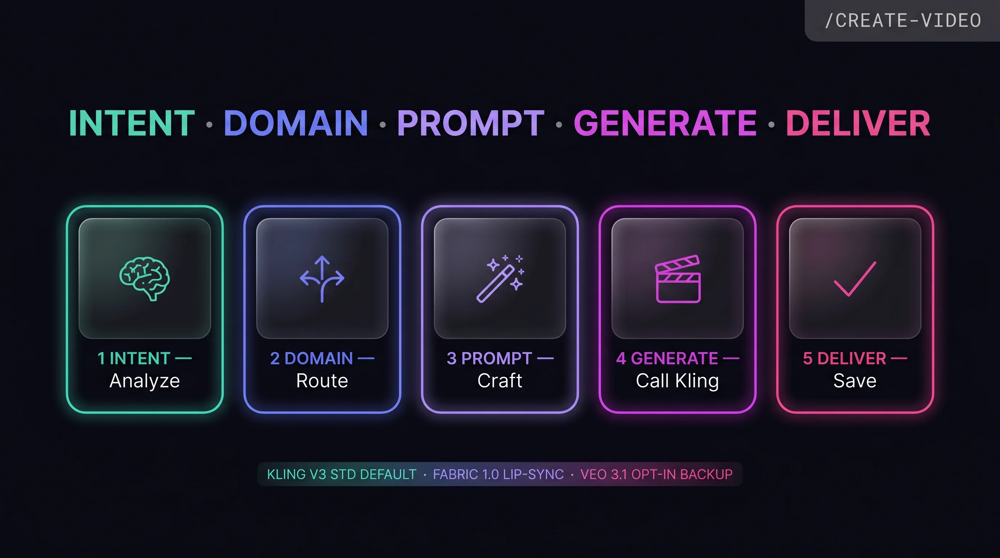
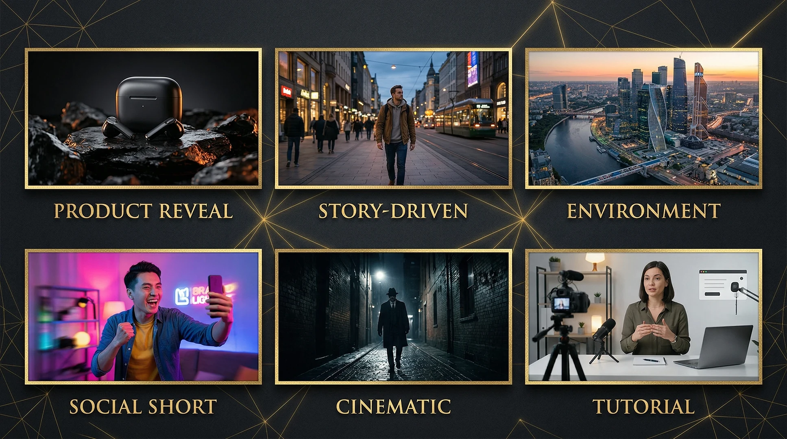
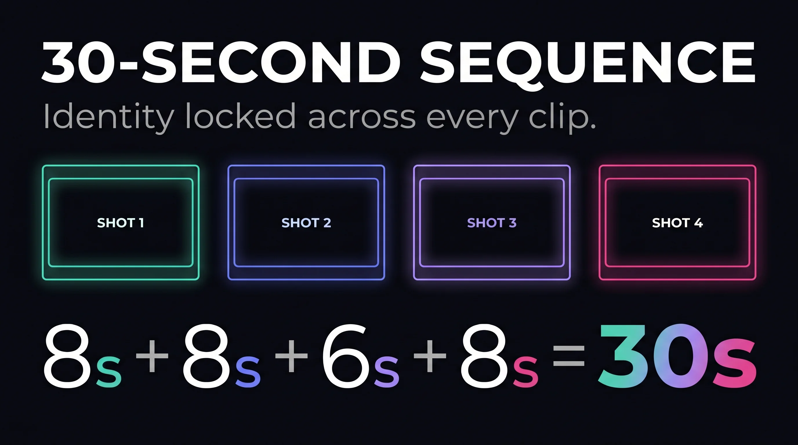
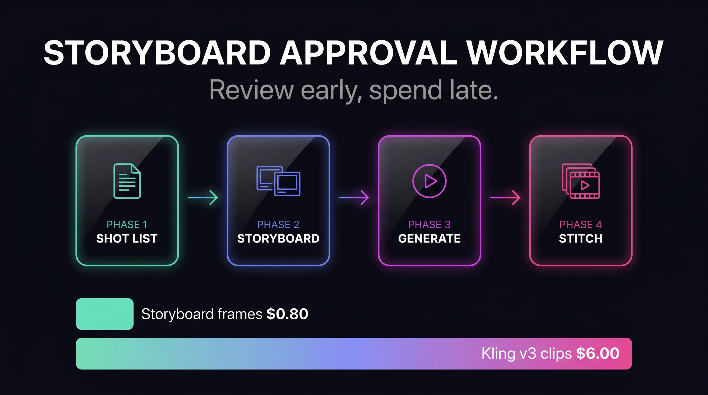
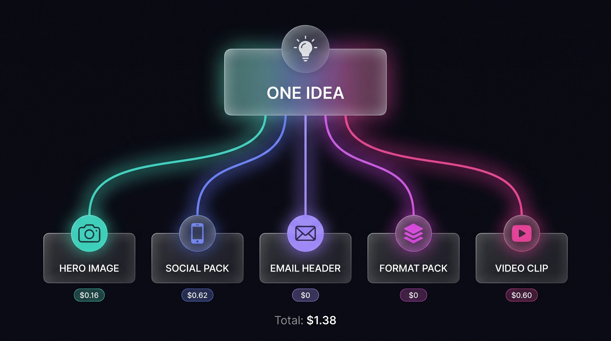
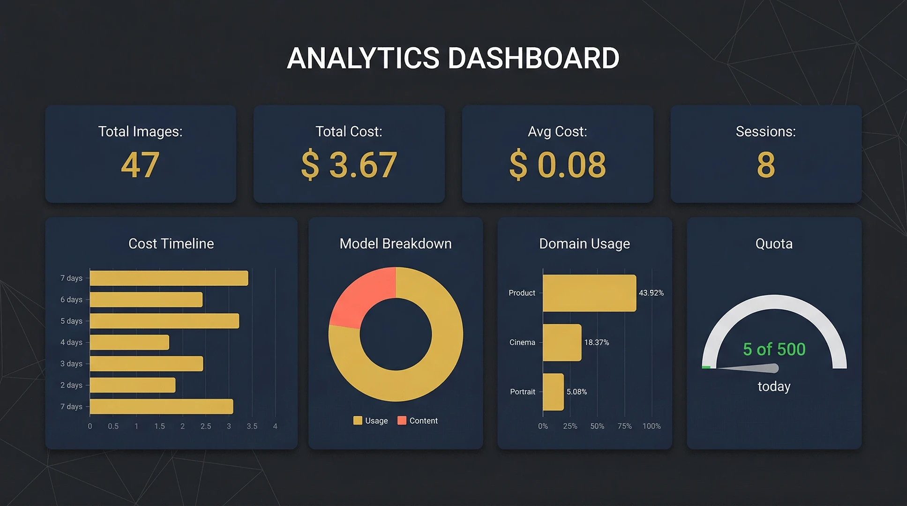
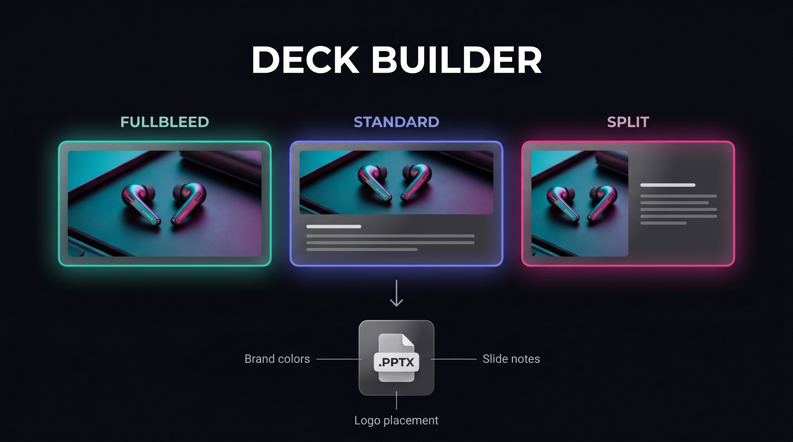
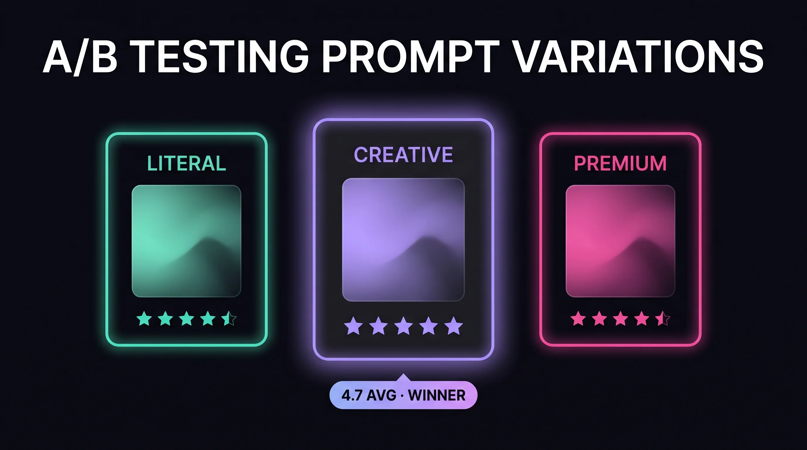

<!-- Updated: 2026-04-11 -->
<!-- Originally forked from: https://github.com/AgriciDaniel/banana-claude -->


# Creators Studio

> **Imagine · Direct · Generate** — Creative Engine for Claude Code

AI image and video generation plugin for Claude Code where **Claude acts as Creative Director** using Google's Gemini and VEO models.

Unlike simple API wrappers, Claude interprets your intent, selects domain expertise, constructs optimized prompts, and orchestrates generation for the best possible results — for both still images and video clips with synchronized audio.

[](https://claude.ai/claude-code)
[](CHANGELOG.md)
[](LICENSE)
<details>
<summary>Table of Contents</summary>

- [Features](#features)
- [Installation](#installation)
- [Quick Start](#quick-start)
- [Commands](#commands) (Image + Video)
- [How It Works](#how-it-works)
- [What Makes This Different](#what-makes-this-different)
- [Domain Modes](#domain-modes) (Image + Video)
- [Models](#models) (Gemini + VEO)
- [Architecture](#architecture)
- [Requirements](#requirements)
- [Changelog](CHANGELOG.md)
- [License](#license)

</details>

## Features

Features driven by production use and research analysis of Google's prompting guidance:

### ElevenLabs Music as Default Provider (v3.8.3)

A 12-genre blind A/B bake-off found ElevenLabs Music decisively outperforms Lyria 2 across every genre tested — cinematic, electronic, lo-fi, jazz, hip-hop, synthwave, and six more. ElevenLabs is now the default `--music-source`; Lyria remains available via `--music-source lyria` for its unique `negative_prompt` feature.

### Character Consistency via start_image (v3.8.2)

Kling's `start_image` feature now serves as a character identity lock for multi-clip brand work: generate a reference image once, then pass it as `--first-frame` on every Kling call with a character-matching prompt — and the character's face, hair, clothing, and accessories persist across separate generations at full 1080p. DreamActor M2.0 (tested in this release at $0.05/s) is deferred to v3.9.x for its narrower real-footage-to-avatar niche.

### Fabric Lip-Sync + Defensive Hardening (v3.8.1)

New `/create-video lipsync` command pairs any face image with any audio file (including custom-designed ElevenLabs voices from `/create-video audio narrate`) to produce a lip-synced talking-head MP4 via VEED Fabric 1.0 — closing the v3.8.0 gap where VEO generated speech internally and Kling didn't accept audio at all. Also includes Cloudflare User-Agent hardening on the image-gen Replicate path, a new `_vertex_backend smoke-test` subcommand that validates v3.8.0 spike constraints without burning budget, and the final verdict on the user-requested Seedance 2.0 retest: **permanently rejected** (E005 filter triggers on every human subject tested).

### Kling v3 as Default Video Model (v3.8.0)

v3.8.0 switches the default video model from VEO 3.1 to Kling v3 Std (via Replicate) after a 15-shot-type head-to-head bake-off. Kling wins 8 of 15 playback-verified shot types (VEO 0), is 7.5× cheaper per 8s clip, natively supports 1:1 Instagram-square aspect ratio, and produces coherent 30-second narratives where VEO's extended workflow produces glitches. VEO remains available as an opt-in backup via `--provider veo`.

### Audio Polish + Voice Cloning (v3.7.4)

Five audio-pipeline upgrades in one release: real stereo narration mix (the previous mono-in-stereo-container bug is gone), ElevenLabs **Instant Voice Cloning** via a new `voice-clone` subcommand, automatic per-voice WPM measurement for accurate line-length calibration, automatic multi-call Lyria with FFmpeg crossfade when you ask for music longer than the 32.768s single-clip cap, and shared client-side stripping of named copyrighted creators (Annie Leibovitz, Vanity Fair, Hans Zimmer, BBC Earth, etc.) so Lyria and ElevenLabs Music behave consistently.

### Gemini 3.1 Prompt Guidance Refresh (v3.7.3)

The prompt-engineering reference now leads with Google's official Gemini 3.1 principle — *"describe the scene, don't just list keywords"* — and ships the seven official use-case templates (photorealistic, stylised, text-in-image, product, minimalist, comic, reference-grounded). Legacy Stable-Diffusion-era prompt rules have been retired after empirical testing on Gemini 3.1 Flash Image.

### Google Lyria 2 Music + Multi-Provider Audio Pipeline (v3.7.2)

Google Lyria 2 is now the default music source — broadcast-quality 48 kHz stereo with unique `negative_prompt` support to exclude vocals, dissonance, or harsh percussion. Reuses your existing Vertex AI credentials from VEO setup at a predictable $0.06 per call, and saves both a lossless WAV master and a 256 kbps MP3 preview per generation. ElevenLabs Music remains available via `--music-source elevenlabs` for clips longer than Lyria's 32.768s cap.

### ElevenLabs Audio Replacement Pipeline + Custom Voice Design (v3.7.1)

Stitched VEO sequences often have audible music seams at clip boundaries. One command now replaces the entire audio bed end-to-end — parallel ElevenLabs narration + music + FFmpeg ducked mix + lossless audio swap — and outputs a ship-ready MP4 in about 12 seconds. Plus a custom voice designer: describe a voice in plain English (*"warm baritone with a slight British accent, BBC documentary register"*), pick from three candidates, and save it under a semantic role name like `narrator` or `brand_voice`.

### Review Gate Enforcement + Smarter Plans (v3.6.3)

Mandatory review gate before any VEO generation call — `video_sequence.py generate` refuses to run unless a valid `REVIEW-SHEET.md` exists with matching frame hashes, catching the expensive failure mode of generating a $12 clip against a silently-regenerated frame. Plus shot-type semantic defaults (`plan --shot-types establishing,medium,closeup`) that pre-fill duration, camera hints, and interpolation behaviour from an 8-type table, and a new `--reference-image` flag on banana image generation for cross-shot character continuity.

### Sequence Production Polish (v3.6.2)

Five production-polish items from the first real sequence shoot: new `review` subcommand that renders a human-approvable `REVIEW-SHEET.md` with inline frames, prompts, costs and status badges; `use_veo_interpolation` per-shot flag for cut-away shots that should skip the end frame; partial storyboard regeneration via `--shots 1,3-5`; and a new default output location under `~/Documents/creators_sequences/` so sequences are Finder-visible.

### First+Last Frame Interpolation + Reference Images on Vertex (v3.6.1)

Same-day follow-up to v3.6.0 that wires `--last-frame` and `--reference-image` into the Vertex backend after verifying the exact field names against Google's docs. The draft-then-final sequence workflow can now honour storyboard end frames on every shot, not just the first.

### Vertex AI Backend — Lite, image-to-video, Scene Ext v2 (v3.6.0)

**The full VEO 3.1 capability surface, finally reachable.** A new Vertex AI backend using bound-to-service-account API-key auth (no OAuth, no service account JSON, no `gcloud`) unlocks VEO 3.1 Lite at $0.05/sec (the 8× cost cut for draft-then-final workflows), image-to-video via `--first-frame`, Scene Extension v2, and the GA `-001` model IDs — all the features the Gemini API surface stopped serving when the GA IDs shipped. New `--backend {auto,gemini-api,vertex-ai}` flag on `video_generate.py` with zero breaking changes for existing text-to-video users. 3-minute setup: add three fields to `~/.banana/config.json`.

### VEO 3.1 Model Variants & Draft Workflow (v3.5.0)

v3.5.0 added the model variant routing infrastructure (`--quality-tier`,
per-shot model fields in plan.json, `_veo_cost()` helpers in the cost
tracker) and corrected the VEO pricing in the cost tracker (Standard
was mislabeled at $0.15/sec; the real rate is $0.40/sec). It also added
the `--negative-prompt`/`--seed`/`--video-input` flags on
`video_generate.py`, token-limit prompt validation, and a full rewrite
of `skills/create-video/references/veo-models.md`. The Vertex-only features it
documented but gated are exactly what v3.6.0 unblocks.

### Video Generation with VEO 3.1 (v3.0.0–v3.4.0)



**Sample videos (generated with `/create-video generate`):**

| Product Reveal — 6s / 1080p | Banana Character — 4s / 720p |
|---|---|
| [](https://vimeo.com/1181470215) | [](https://vimeo.com/1181470192) |
| ▶ [Watch on Vimeo](https://vimeo.com/1181470215) — Product reveal with native audio. Generated in ~47 seconds. | ▶ [Watch on Vimeo](https://vimeo.com/1181470192) — Character animation test. Generated in ~36 seconds. |

New `/video` skill powered by Google VEO 3.1. Text-to-video, image-to-video (animate stills from `/banana`), and first/last frame keyframe interpolation for seamless shot chaining. 4-8 second clips at up to 4K with native synchronized audio (dialogue, SFX, ambient). 6 video domain modes (Product Reveal, Story-Driven, Environment Reveal, Social Short, Cinematic, Tutorial/Demo). Multi-shot sequence production with storyboard approval — generate frame pairs cheaply with `/banana` before committing to video generation. Clip extension to 148 seconds. FFmpeg toolkit for concat/trim/convert. Same API key, shared brand presets and asset registry.







### Multi-Modal Content Pipeline (v2.7.0)


One idea, complete content package. Orchestrates hero image, social media pack, email headers, and format variants from a single brief. Two-phase workflow: plan (cost estimate) then generate. Dependency handling ensures email/formats wait for the hero image.

### Analytics Dashboard (v2.6.0)


Self-contained HTML dashboard with inline SVG charts showing cost trends, model/domain usage, resolution distribution, and quota monitoring. Aggregates data from cost tracker, session history, and A/B preferences. No external dependencies — opens in any browser.

### Deck Builder (v2.5.0)


Assemble generated slide images into editable .pptx presentations with text layers, brand styling, and logo placement. Three layouts: fullbleed, standard, split. Reads generation-summary.json from `/create-image slides` for slide notes with original prompts.

### Smart A/B Testing (v2.4.0)


Generate Literal/Creative/Premium prompt variations from the same brief. Rate the results on a 1-5 scale, and preferences are tracked over time to learn which styles work best for you.

### Session History with Gallery Export (v2.3.0)
Track all image generations per session. View history, show details for any entry, and export as a markdown gallery with inline images. Automatically logged after every generation.

### Multi-Format Output (v2.2.0)
Generate once at max resolution, convert to PNG/WebP/JPEG at 4K/2K/1K/512 via ImageMagick (or macOS sips). Outputs an organized directory with manifest.json for downstream tools like the content pipeline.

### Visual Brand Book Generator (v2.0.0)
Generate complete visual brand books from any preset in three formats: Markdown + images, PowerPoint (.pptx), and self-contained HTML (print to PDF). Three tiers — quick (5 images), standard (16), comprehensive (25+). Automatic Hex → RGB → CMYK → Pantone color conversion with 156 Pantone Coated colors.

### Reverse Prompt Engineering (v1.9.0)
Upload any image and Claude decomposes it into a structured 5-Component Formula prompt — identifying domain mode, camera specs, lighting, composition, and style. Compares Claude vs Gemini perspectives and provides a blended best-of-both prompt.

### Asset Registry (v1.8.0)
Persistent named references for characters, products, equipment, and environments. Save once with reference images, reuse across sessions — Claude automatically loads reference images and consistency notes into every generation.

### Social Media Generation (v1.7.0)
Platform-native image generation for 46 social media platforms. Generates at the correct native ratio at 4K resolution, then auto-crops to exact platform pixel specs. One prompt → multiple platform-specific images. Groups platforms by ratio to avoid duplicate API calls.

### Brand Guide Builder (v1.7.0)
Conversational brand guide creation: learn from websites/PDFs/images → auto-extract colors, typography, mood → refine interactively → preview with sample image → save. Ships with 12 example brand presets covering tech, luxury, organic, fitness, healthcare, fashion, and more.

### Slide Deck Pipeline (v1.6.0)
Three-step batch pipeline: content → design brief → prompts → batch-generate all slide images. Replaces a manual 3-step, 2-session workflow.

### Presentation Mode (v1.5.0)
Two generation options for slide visuals:
- **Complete Slide** -- Nano Banana 2 renders headline and body text directly in the image, producing finished slides
- **Background Only** -- Clean backgrounds with intentional negative space, designed for layering text and logos in Keynote/PowerPoint/Google Slides

Logos are never mentioned in prompts (the model generates unwanted artifacts). Instead, logo areas are described as "clean negative space" and logos are composited in presentation software.

### Brand Style Guides (v1.5.0)
Enhanced preset system with 8 new optional fields for project-wide visual consistency:
- `background_styles` -- Named background variants (dark-premium, gradient, split-layout)
- `visual_motifs` -- Pattern overlays with opacity (e.g., "geometric network at 30%")
- `prompt_suffix` -- Appended verbatim to every prompt for brand consistency
- `prompt_keywords` -- Categorized keywords woven naturally into prompts
- `do_list` / `dont_list` -- Brand guardrails checked before generation
- `logo_placement` -- Records where logos go in post-production (not in prompts)
- `technical_specs` -- Default color space, DPI, and other technical standards

Fully backward-compatible -- existing simple presets continue to work unchanged.

### Replicate Backend (v1.4.2)
`google/nano-banana-2` on Replicate as an alternative API backend. Fallback chain: MCP (primary) -> Direct Gemini API -> Replicate. Includes `replicate_generate.py` and `replicate_edit.py` (stdlib-only, zero pip deps).

### Research-Driven Improvements (v1.4.2)
Based on analysis of Google's official prompting guides and two research documents:
- **5-Input Creative Brief** -- Purpose, Audience, Subject, Brand, References
- **"Start with Intent, Refine with Specs"** -- Two-phase prompting with PEEL strategy (Position, Expression, Environment, Lens)
- **Edit-First Principle** -- 90% of refinements should edit, not regenerate
- **Progressive Enhancement** -- 4-phase workflow for multi-turn chat sessions
- **Expanded character consistency** -- Identity-locked patterns, group photos (up to 5 people), sequential storytelling
- **Multilingual support** -- Translation within images, cultural adaptation
- **Official spec corrections** -- Output tokens (2,520 not 1,290), HEIC/HEIF input, resolution pixel tables

## Installation

### Prerequisites

- [Claude Code](https://claude.ai/claude-code) installed and working
- [Git](https://git-scm.com/) installed
- [Node.js 18+](https://nodejs.org/) installed (for the MCP server)

### Step 1: Clone the Repository

```bash
git clone https://github.com/juliandickie/creators-studio.git ~/creators-studio
```

### Step 2: Get Your Google AI API Key

1. Go to [Google AI Studio](https://aistudio.google.com/apikey)
2. Sign in with your Google account
3. Click **"Create API Key"**
4. Select any Google Cloud project (or create one -- it's free)
5. Copy the key (starts with `AIza...`)

> **Image generation (free tier):** ~5-15 images per minute, ~20-500 per day. No credit card required.
>
> **Video generation (paid):** VEO 3.1 requires billing enabled. $0.15/sec fast ($1.20 per 8s clip) or $0.40/sec standard. No free tier for video.

### Step 3: Start Claude Code with the Plugin

```bash
claude --plugin-dir ~/creators-studio
```

### Step 4: Configure Your API Key

In Claude Code, run:

```
/create-image setup
```

Claude will walk you through the process conversationally — explaining what the key is, where to get it, and asking you to paste it in the chat. Your key is saved to:
- `~/.claude/settings.json` (for the MCP server)
- `~/.banana/config.json` (for fallback scripts)

Keys never leave your machine and are not sent to GitHub.

### Step 5: Test It

```
/create-image generate "a golden banana wearing a beret"
```

If you see an image path and the file exists, you're all set!

### Updating

```bash
cd ~/creators-studio && git pull
```

Then in Claude Code, type `/reload-plugins` to pick up changes.

<details>
<summary>Optional: Replicate as Fallback Backend</summary>

Replicate provides an alternative API backend using `google/nano-banana-2`. It's useful when the MCP server isn't available, or if you prefer simpler auth. It costs ~$0.05/image (no free tier).

**Getting your Replicate API token:**

1. Go to [replicate.com/account/api-tokens](https://replicate.com/account/api-tokens)
2. Sign in with GitHub, Google, or email
3. Click **"Create token"**
4. Give it a name (e.g., "creators-studio")
5. Copy the token (starts with `r8_...`)

**Configure it in Claude Code:**

```
/create-image setup replicate
```

Claude will walk you through the process and ask you to paste the token. Your token is saved to `~/.banana/config.json` and never leaves your machine.

The fallback chain is automatic: MCP → Direct Gemini API → Replicate.

</details>

<details>
<summary>Standalone Install (without plugin system)</summary>

If you prefer to copy the skill files rather than use the plugin system:

```bash
git clone https://github.com/juliandickie/creators-studio.git ~/creators-studio
bash ~/creators-studio/install.sh
```

To update: `cd ~/creators-studio && git pull && bash install.sh`

</details>

## Quick Start

```bash
# Generate an image (Claude acts as Creative Director)
/create-image generate "a hero image for a coffee shop website"

# Edit an existing image
/create-image edit ~/photo.png "remove the background and add warm lighting"

# Multi-turn creative session with character/style consistency
/create-image chat

# Generate for multiple social platforms at once (46 platforms)
/create-image social "product launch hero" --platforms ig-feed,yt-thumb,li-feed,tt-feed

# Build a brand guide from your website or documents
/create-image brand

# Generate a slide deck from transcripts or content
/create-image slides plan --content ~/transcripts/ --preset my-brand

# Save a product/character for consistent reuse across sessions
/create-image asset create "my-headphones" --type product \
  --reference ~/photos/headphones.jpg \
  --description "wireless earbuds in white charging case"

# Use a brand preset for visual consistency
/create-image preset list                    # see available presets
/create-image preset create my-brand --colors "#000,#FFC000" --style "premium dark"

# Generate 3 variations (Literal, Creative, Premium)
/create-image batch "landing page hero for fintech app" 3

# Reverse engineer a prompt from an image
/create-image reverse ~/photos/inspiration.jpg

# Generate a visual brand book (markdown + pptx + html)
/create-image book --preset my-brand --tier standard --output ~/brand-book/

# Browse prompt inspiration
/create-image inspire

# Check costs and usage
/create-image cost summary

# Setup, status, and updates
/create-image setup                          # configure API key (guided)
/create-image status                         # check version + keys
/create-image update                         # pull latest from GitHub

# --- Video Generation (VEO 3.1) ---

# Generate a video clip (8s, 16:9, with audio)
/create-video generate "product reveal of wireless earbuds on dark surface"

# Animate a still image from /banana
/create-video animate ~/image.png "slow orbit revealing the product, SFX: soft whoosh"

# Multi-shot sequence with storyboard approval
/create-video sequence plan --script "30-second product launch ad" --target 30
/create-video sequence storyboard --plan shot-list.json     # preview frames before video
/create-video sequence review --plan shot-list.json --storyboard ~/storyboard/ \
                       --quality-tier draft          # human approval gate (free)
/create-video sequence generate --storyboard ~/storyboard/ --quality-tier draft
/create-video sequence stitch --clips ~/clips/ --output final.mp4

# Extend a clip to 30 seconds
/create-video extend clip.mp4 --target-duration 30
```

Claude acts as Creative Director for both images and video — selecting domain modes, constructing optimized prompts with camera motion and audio, and managing brand/asset consistency across media.


## Commands

| Command | Description |
|---------|-------------|
| `/create-image` | Interactive -- Claude detects intent and guides you |
| `/create-image generate <idea>` | Full Creative Director pipeline |
| `/create-image edit <path> <instructions>` | Intelligent image editing |
| `/create-image chat` | Multi-turn visual session (character/style consistent) |
| `/create-image slides [plan\|prompts\|generate]` | Slide deck pipeline: content → design brief → prompts → batch images |
| `/create-image inspire [category]` | Browse prompt database for ideas |
| `/create-image batch <idea> [N]` | Generate N variations (default: 3) |
| `/create-image social <idea> --platforms <list>` | Platform-native image generation (46 platforms, 4K, auto-crop) |
| `/create-image brand` | Conversational brand guide builder (learn → refine → preview → save) |
| `/create-image asset [list\|show\|create\|delete]` | Manage persistent character/product/object references |
| `/create-image reverse <image-path>` | Analyze image → extract 5-Component Formula prompt |
| `/create-image book --preset <name> [--tier quick\|standard\|comprehensive]` | Generate visual brand book (markdown + pptx + html) |
| `/create-image setup` | Guided Google AI API key setup |
| `/create-image setup replicate` | Guided Replicate token setup (optional fallback) |
| `/create-image status` | Check version, installation, and API key status |
| `/create-image update` | Pull latest version from GitHub |
| `/create-image preset [list\|create\|show\|delete]` | Manage brand/style presets |
| `/create-image cost [summary\|today\|estimate]` | View cost tracking and estimates |
| `/create-image formats <path> [--formats] [--sizes]` | Convert image to multiple formats/sizes |
| `/create-image history [list\|show\|export\|sessions]` | View session generation history and export gallery |
| `/create-image ab-test <idea> [--count N]` | Generate Literal/Creative/Premium variations and track preferences |
| `/create-image deck --images DIR --output PATH` | Assemble slide images into editable .pptx with brand styling |
| `/create-image analytics [--format html\|json]` | Usage analytics dashboard (cost trends, domain usage, quota) |
| `/create-image content <idea> --outputs hero,social,email` | Multi-modal content pipeline from a single idea |
| | |
| **Video Commands** | |
| `/create-video generate <idea>` | Text-to-video with full Creative Director pipeline |
| `/create-video animate <image> <motion>` | Animate a still image (from /create-image or uploaded) |
| `/create-video sequence plan --script "..." --target Ns [--shot-types ...]` | Break a script into a shot list with shot-type defaults |
| `/create-video sequence storyboard --plan PATH [--shots 1,3-5]` | Generate start/end frame pairs (optionally a subset) |
| `/create-video sequence review --plan PATH --storyboard DIR` | Generate REVIEW-SHEET.md — mandatory approval gate in v3.6.3+ |
| `/create-video sequence generate --storyboard PATH [--skip-review]` | Batch-generate clips from approved storyboard frames |
| `/create-video sequence stitch --clips DIR --output PATH` | Assemble clips into final sequence via FFmpeg |
| `/create-video extend <clip> [--to Ns]` | Extend a clip (+7s per hop, max 148s) |
| `/create-video stitch <clips...>` | Concat, trim, convert video via FFmpeg |
| `/create-video cost [estimate]` | Video cost estimation |
| `/create-video status` | Check VEO API access and FFmpeg availability |

## How It Works


## What Makes This Different


- **5-Input Creative Brief** -- Gathers Purpose, Audience, Subject, Brand, and References before generating
- **Domain Expertise** -- Selects the right creative lens (Cinema, Product, Portrait, Editorial, UI, Logo, Landscape, Infographic, Abstract, Presentation)
- **5-Component Prompt Formula** -- Constructs prompts with Subject + Action + Location/Context + Composition + Style (includes lighting)
- **Start with Intent, Refine with Specs** -- Two-phase prompting using the PEEL strategy for iterative refinement
- **Edit-First Workflow** -- 90% of refinements edit the image rather than regenerating from scratch
- **Brand Style Guides** -- Rich preset system with background styles, motifs, keywords, do's/don'ts, and prompt suffixes
- **Presentation Mode** -- Two options: complete slides with rendered text, or clean backgrounds for layering
- **Prompt Adaptation** -- Translates patterns from a 2,500+ curated prompt database to Gemini's natural language format
- **Post-Processing** -- Crops, removes backgrounds, converts formats, resizes for platforms
- **Batch Variations** -- Generates N variations with Literal/Creative/Premium prompt styles
- **Session Consistency** -- Maintains character/style across multi-turn conversations with progressive enhancement
- **Triple Fallback** -- MCP -> Direct Gemini API -> Replicate for maximum availability
- **4K Resolution Output** -- Up to 4096×4096 with `imageSize` control
- **14 Aspect Ratios** -- Including ultra-wide 21:9 and extreme 8:1 for banners

## The 5-Component Prompt Formula


Instead of sending "a cat in space" to Gemini, Claude constructs:

> A medium shot of a tabby cat floating weightlessly inside the cupola module
> of the International Space Station, paws outstretched toward a floating
> droplet of water, Earth visible through the circular windows behind. Soft
> directional light from the windows illuminates the cat's fur with a
> blue-white rim light, while the interior has warm amber instrument panel
> glow. Captured with a Canon EOS R5, 35mm f/2.0 lens, slight barrel
> distortion emphasizing the curved module interior. In the style of a
> National Geographic cover story on the ISS, with the sharp documentary
> clarity of NASA mission photography.

**Components used:** Subject (tabby cat, physical detail) → Action (floating, paw gesture) → Location/Context (ISS cupola, Earth visible) → Composition (medium shot, curved framing) → Style (Canon R5, National Geographic documentary, directional window light + amber instruments)

## Domain Modes


| Mode | Best For | Example |
|------|----------|---------|
| **Cinema** | Dramatic, storytelling | "A noir detective scene in a rain-soaked alley" |
| **Product** | E-commerce, packshots | "Photograph my handmade candle for Etsy" |
| **Portrait** | People, characters | "A cyberpunk character portrait for my game" |
| **Editorial** | Fashion, lifestyle | "Vogue-style fashion shot for my brand" |
| **UI/Web** | Icons, illustrations | "A set of onboarding illustrations" |
| **Logo** | Branding, identity | "A minimalist logo for a tech startup" |
| **Landscape** | Backgrounds, wallpapers | "A misty mountain sunrise for my desktop" |
| **Infographic** | Data, diagrams | "Visualize our Q1 sales growth" |
| **Abstract** | Generative art, textures | "Voronoi tessellation in neon gradients" |
| **Presentation (Complete)** | Finished slides with text | "Title slide with 'DIGITAL INNOVATION' headline" |
| **Presentation (Background)** | Slide backgrounds for layering | "Dark premium background for keynote deck" |

## Presentation Mode


Presentation mode has two generation options designed for real-world slide workflows:

**Complete Slide** -- The model renders headline and body text directly in the image. Nano Banana 2's text rendering (94% accuracy under 25 characters) produces finished slides ready to use as-is. Best for title slides, quote slides, and simple content layouts.

**Background Only** -- Produces clean backgrounds with intentional negative space where text and logos will be added in Keynote, PowerPoint, or Google Slides. The prompt explicitly states "NO text, NO logos, NO labels" to prevent the model from generating unwanted artifacts.

> **Why no logos in prompts?** Gemini interprets every word literally. "Reserve space for logo" becomes "generate a logo here." The correct approach is describing the area as "clean negative space" or "simple uncluttered background," then compositing the logo as a separate layer in your presentation software where you have pixel-perfect control.

## Asset Registry


Save named characters, products, equipment, and environments with reference images for consistent reuse across sessions. When you mention a saved asset, Claude automatically loads its reference images and consistency notes.

```bash
# Save a product with reference images
/create-image asset create "itero-scanner" --type product \
  --reference ~/photos/itero-front.jpg \
  --reference ~/photos/itero-angle.jpg \
  --description "Handheld intraoral scanner, white and gray body, LED ring" \
  --consistency-notes "Always show LED ring illuminated"

# Now just mention it naturally
/create-image generate "the iTero Scanner being used in a modern dental clinic"
# Claude loads reference images automatically for visual consistency

# Add more reference images later
/create-image asset add-image "itero-scanner" --reference ~/photos/itero-closeup.jpg

# See all saved assets
/create-image asset list
```

Assets work alongside brand presets — the preset defines the visual style, the asset defines what the object looks like. Both are applied automatically when detected.

## Social Media Generation


Generate platform-native images for 46 social media platforms. One prompt, multiple platform-specific outputs — each generated at the correct native ratio at 4K, then auto-cropped to exact pixel specs.

```bash
/create-image social "product launch hero for wireless earbuds" --platforms ig-feed,yt-thumb,li-feed,tt-feed
```

Platforms sharing the same ratio are grouped automatically — if Instagram feed and Facebook portrait both use 4:5, only one API call is made and cropped to both specs. Saves cost and time.

Supports: Instagram, Facebook, YouTube, LinkedIn, Twitter/X, TikTok, Pinterest, Threads, Snapchat, Google Ads, and Spotify — including organic posts, stories, ads, banners, thumbnails, and covers.

## Brand Style Guides


Enhanced presets for project-wide visual consistency. Create a brand style guide once, and every generated image inherits the brand's visual language:

```bash
# Create a brand style guide
/create-image preset create premium-brand \
  --colors "#000000,#FFC000,#FFFFFF" \
  --style "premium dark photography, dramatic lighting, gold accents" \
  --mood "confident, innovative, premium" \
  --visual-motifs "geometric network pattern in silver at 30% opacity" \
  --prompt-suffix "Premium dark aesthetic with gold accents, dramatic lighting." \
  --do-list "Use negative space,High contrast,Keep patterns subtle" \
  --dont-list "No busy backgrounds,No more than 2 accent colors"

# Use it
/create-image generate "title slide for digital innovation keynote"
# Claude automatically loads the brand guide and applies it
```

Brand Style Guide fields are all optional -- simple presets (just colors + style) continue to work exactly as before.

## Replicate Backend

An alternative API backend using `google/nano-banana-2` on Replicate. Useful when:
- MCP server is unavailable or not configured
- You prefer simpler auth (Replicate token vs. Google Cloud setup)
- You need webhook/async processing

```bash
# Configure Replicate
/create-image setup replicate

# The fallback chain handles the rest automatically:
# 1. MCP (primary) -> 2. Direct Gemini API -> 3. Replicate
```

## Models

### Image Models

| Model | ID | Notes |
|-------|----|-------|
| Flash 3.1 (default) | `gemini-3.1-flash-image-preview` | Fastest, newest, 14 aspect ratios, up to 4K |
| Flash 2.5 | `gemini-2.5-flash-image` | Stable fallback, budget/free tier |

### Video Models

| Model | ID | Backend (auto-routed) | Notes |
|-------|----|---|---|
| VEO 3.1 Standard (default) | `veo-3.1-generate-preview` | ✅ Gemini API | 4-8s, 1080p/4K, native audio, $0.40/sec |
| VEO 3.1 Fast | `veo-3.1-fast-generate-preview` | ✅ Gemini API | 4-8s, 1080p/4K, $0.15/sec |
| VEO 3.1 Standard GA | `veo-3.1-generate-001` | ✅ Vertex AI (v3.6.0) | GA equivalent, full feature surface |
| VEO 3.1 Fast GA | `veo-3.1-fast-generate-001` | ✅ Vertex AI (v3.6.0) | GA equivalent |
| VEO 3.1 Lite | `veo-3.1-lite-generate-001` | ✅ Vertex AI (v3.6.0) | 4/6/8s, 720p/1080p, $0.05/sec — **draft tier** |
| VEO 3.0 (legacy) | `veo-3.0-generate-001` | ✅ Vertex AI (v3.6.0) | Predecessor for reproduction |

For sequences, **draft at Lite first** (`/create-video sequence generate
--quality-tier draft`) then re-render approved shots at Standard —
**8× cheaper** than blind Standard for the draft pass. See the
draft-then-final workflow in
`skills/create-video/references/video-sequences.md`. Lite, GA `-001` IDs,
image-to-video, and Scene Extension v2 all require `vertex_api_key`
in `~/.banana/config.json`.

## Architecture

```
creators-studio/                       # Claude Code Plugin
├── .claude-plugin/
│   ├── plugin.json                    # Plugin manifest
│   └── marketplace.json               # Marketplace catalog
├── skills/create-image/               # Main skill
│   ├── SKILL.md                       # Creative Director orchestrator (~200 lines)
│   ├── references/
│   │   ├── prompt-engineering.md      # 5-component formula, 11 domain modes, PEEL strategy
│   │   ├── gemini-models.md           # Model specs, resolution tables, input limits
│   │   ├── mcp-tools.md              # MCP tool parameters and responses
│   │   ├── replicate.md              # Replicate backend API reference
│   │   ├── social-platforms.md        # 46 social media platform specs and ratios
│   │   ├── brand-builder.md           # Conversational brand guide creation flow
│   │   ├── asset-registry.md          # Persistent asset registry for characters/products
│   │   ├── reverse-prompt.md          # Image → 5-Component Formula prompt extraction
│   │   ├── brand-book.md             # Brand book generator (tiers, formats, colors)
│   │   ├── post-processing.md        # ImageMagick/FFmpeg pipelines, green screen
│   │   ├── cost-tracking.md          # Pricing table, usage guide
│   │   ├── presets.md                # Brand Style Guide schema (17 fields)
│   │   ├── content-pipeline.md         # Content pipeline output types, dependencies
│   │   ├── analytics.md               # Analytics dashboard sections, data sources
│   │   ├── deck-builder.md            # Deck assembly, layouts, preset integration
│   │   ├── ab-testing.md              # A/B variation styles, rating, preferences
│   │   ├── session-history.md         # Session history tracking and gallery export
│   │   ├── multi-format.md           # Multi-format conversion (sizes, formats)
│   │   └── setup.md                  # Guided API key configuration flow
│   ├── presets/                       # 12 example brand guide JSON files
│   │   ├── tech-saas.json
│   │   ├── luxury-dark.json
│   │   ├── ... (10 more)
│   │   └── education-friendly.json
│   └── scripts/
│       ├── setup_mcp.py              # Configure MCP + Replicate
│       ├── validate_setup.py         # Verify installation
│       ├── generate.py               # Direct Gemini API fallback -- generation
│       ├── edit.py                   # Direct Gemini API fallback -- editing
│       ├── replicate_generate.py     # Replicate API fallback -- generation
│       ├── replicate_edit.py         # Replicate API fallback -- editing
│       ├── brandbook.py              # Visual brand book generator (3 output formats)
│       ├── pantone_lookup.py         # Color conversion (Hex/RGB/CMYK/Pantone)
│       ├── assets.py                 # Asset registry CRUD (characters, products, objects)
│       ├── social.py                 # Social media platform-native generation
│       ├── slides.py                 # Slide deck batch generation pipeline
│       ├── cost_tracker.py           # Cost logging and summaries
│       ├── presets.py                # Brand Style Guide management
│       ├── content_pipeline.py         # Multi-modal content pipeline orchestrator
│       ├── analytics.py                # Analytics dashboard (HTML with SVG charts)
│       ├── deckbuilder.py              # Slide deck builder (.pptx with brand styling)
│       ├── abtester.py                # A/B prompt variation tester with preference tracking
│       ├── history.py                 # Session generation history and gallery export
│       ├── multiformat.py             # Multi-format image converter (PNG/WebP/JPEG)
│       └── batch.py                  # CSV batch workflow parser
├── skills/create-video/               # Video generation skill (Kling v3 Std default, VEO 3.1 backup, Fabric 1.0 lip-sync v3.8.1+)
│   ├── SKILL.md                       # Video Creative Director orchestrator (v3.8.0: Kling default)
│   ├── scripts/
│   │   ├── video_generate.py          # Async video API with polling, --backend/--provider routing
│   │   ├── _vertex_backend.py         # Vertex AI helper (v3.6.0) — URL composer, request body builder, response parser, --diagnose + --smoke-test CLIs (v3.8.1)
│   │   ├── _replicate_backend.py      # Replicate helper (v3.8.0) — Kling v3 Std + Fabric 1.0 (v3.8.1), full 6-status enum parser, --diagnose CLI
│   │   ├── video_sequence.py          # Multi-shot sequence production pipeline + review gate (v3.6.2/3.6.3, Kling tiers in v3.8.0)
│   │   ├── video_extend.py            # DEPRECATED in v3.8.0 — requires --acknowledge-veo-limitations
│   │   ├── video_lipsync.py           # v3.8.1 Fabric 1.0 lip-sync runner — image + audio → talking-head MP4
│   │   └── video_stitch.py            # FFmpeg concat/trim/convert/info
│   └── references/
│       ├── kling-models.md            # v3.8.0 Kling v3 Std default + v3.8.1 Seedance retest verdict
│       ├── lipsync.md                 # v3.8.1 Fabric 1.0 audio-driven lip-sync — 2-step workflow with audio_pipeline
│       ├── veo-models.md              # VEO model specs + v3.8.0 BACKUP ONLY status + Phase 2 Vertex constraints
│       ├── video-prompt-engineering.md # 5-Part Video Framework, camera motion
│       ├── video-domain-modes.md      # 6 domain modes + shot types for sequences
│       ├── video-sequences.md         # Multi-shot production, storyboard approval
│       ├── video-audio.md             # Audio prompting (dialogue/SFX/ambient)
│       └── image-to-video.md          # Animate-a-still pipeline
└── agents/
    ├── brief-constructor.md           # Image prompt subagent
    └── video-brief-constructor.md     # Video prompt subagent
```

## Requirements

- [Claude Code](https://claude.ai/claude-code)
- Node.js 18+ (for npx)
- Google AI API key (free tier for images; billing required for video)
- ImageMagick (optional, for image post-processing and multi-format conversion)
- FFmpeg (optional, for video extension, stitching, and format conversion)

## Uninstall

Remove the plugin directory or stop using `--plugin-dir`.

## License

MIT License -- see [LICENSE](LICENSE) for details.

---

Originally built for Claude Code by [@AgriciDaniel](https://github.com/AgriciDaniel). Extended by [@juliandickie](https://github.com/juliandickie) with video generation (VEO 3.1), multi-shot sequence production, Replicate backend, social media generation, brand style guides, deck builder, analytics dashboard, content pipeline, and research-driven prompt improvements.
